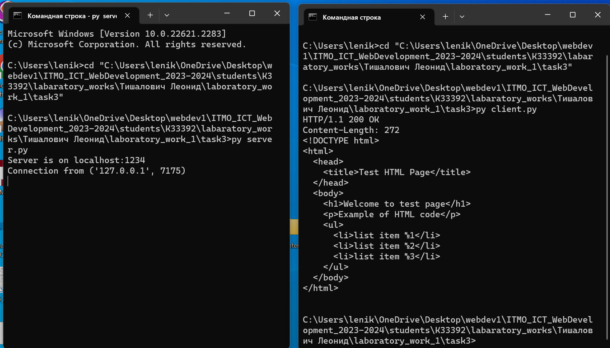

# Задание 3

Реализовать серверную часть приложения. Клиент подключается к серверу. В ответ
клиент получает http-сообщение, содержащее html-страницу, которую сервер
подгружает из файла index.html.

Обязательно использовать библиотеку socket

## Ход выполнения работы

### Код server.py

    import socket

    server_address = ('localhost', 1234)

    server_socket = socket.socket(socket.AF_INET, socket.SOCK_STREAM)

    server_socket.bind(server_address)

    server_socket.listen(100)

    print(f"Server is on {server_address[0]}:{server_address[1]}")

    while True:
        client_socket, client_address = server_socket.accept()
        print(f"Connection from {client_address}")

        with open('index.html', 'r', encoding='utf-8') as file:
            html_content = file.read()

        response = f"HTTP/1.1 200 OK\r\nContent-Length: {len(html_content)}\r\n\r\n{html_content}"
        client_socket.sendall(response.encode('utf-8'))

        client_socket.close()

### Код client.py

    import socket

    server_address = ('localhost', 1234)

    client_socket = socket.socket(socket.AF_INET, socket.SOCK_STREAM)

    client_socket.connect(server_address)

    http_request = "GET / HTTP/1.1\r\nHost: localhost\r\n\r\n"
    client_socket.sendall(http_request.encode('utf-8'))

    response = b""
    while True:
        try:
            data = client_socket.recv(1024)
        except:
            break
        response += data

    client_socket.close()

    http_response = response.decode('utf-8')
    header, html_content = http_response.split('\r\n\r\n', 1)

    print(header)
    print(html_content)

### Код index.html

    <!DOCTYPE html>
    <html>
    <head>
        <title>Test HTML Page</title>
    </head>
    <body>
        <h1>Welcome to test page</h1>
        
Example of HTML code

        <ul>
        <li>list item №1</li>
        <li>list item №2</li>
        <li>list item №3</li>
        </ul>
    </body>
    </html>

## Результат

