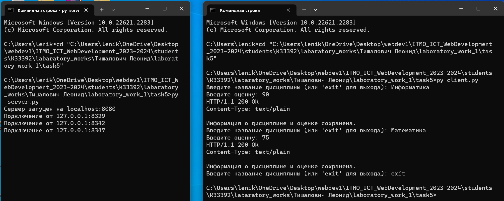

# Задание 5

Необходимо написать простой web-сервер для обработки GET и POST http
запросов средствами Python и библиотеки socket.

Задание: сделать сервер, который может:
● Принять и записать информацию о дисциплине и оценке по дисциплине.
● Отдать информацию обо всех оценах по дсициплине в виде html-страницы.

## Ход выполнения работы

### Код server.py

    import socket
    import re
    import json

    server_socket = socket.socket(socket.AF_INET, socket.SOCK_STREAM)

    server_address = ('localhost', 8080)

    server_socket.bind(server_address)

    server_socket.listen(1)

    print("Сервер запущен на {}:{}".format(server_address[0], server_address[1]))

    grades = {}

    def handle_request(request):
        global grades
        response = ""

        # Если запрос начинается с "GET", возвращаем список оценок в формате JSON
        if request.startswith("GET"):
            response += "HTTP/1.1 200 OK\r\nContent-Type: application/json; charset=utf-8\r\n\r\n"
            response += json.dumps(grades, ensure_ascii=False)

        # Если запрос начинается с "POST", извлекаем данные о дисциплине и оценке из запроса
        elif request.startswith("POST"):
            match = re.search(r"discipline=(\w+)&grade=(\d+)", request)
            if match:
                discipline = match.group(1)
                grade = match.group(2)
                grades[discipline] = grade
                # Возвращаем успешный ответ и сообщение о сохранении данных
                response += "HTTP/1.1 200 OK\r\nContent-Type: text/plain\r\n\r\n"
                response += "Информация о дисциплине и оценке сохранена."
            else:
                # Если данные в запросе некорректны, возвращаем ошибку
                response += "HTTP/1.1 400 Bad Request\r\nContent-Type: text/plain\r\n\r\n"
                response += "Ошибка: Некорректные данные в POST запросе."

        return response

    while True:
        # Принимаем входящее подключение и получаем соксет клиента и его адрес
        client_socket, client_address = server_socket.accept()
        print("Подключение от {}:{}".format(client_address[0], client_address[1]))

        # Получаем запрос от клиента и декодируем его
        request = client_socket.recv(1024).decode('utf-8')

        # Обрабатываем запрос и получаем ответ
        response = handle_request(request)

        client_socket.send(response.encode('utf-8'))

        client_socket.close()

### Код client.py

    import socket

    # Указываем адрес сервера и порт
    server_address = ('localhost', 8080)

    while True:
        try:
            # Создаем клиентский соксет
            client_socket = socket.socket(socket.AF_INET, socket.SOCK_STREAM)

            # Устанавливаем соединение с сервером
            client_socket.connect(server_address)
            # Запрашиваем у пользователя название дисциплины
            discipline = input(
                "Введите название дисциплины (или 'exit' для выхода): ")
            # Если пользователь ввел 'exit', выходим из цикла
            if discipline.lower() == 'exit':
                break
            # Запрашиваем оценку у пользователя
            grade = input("Введите оценку: ")

            # Формируем POST-запрос для отправки на сервер
            post_request = "POST / HTTP/1.1\r\n" # Задаем начало POST-запроса, указываем метод, путь и версию протокола
            post_request += "Host: {}\r\n".format(server_address[0]) # Указываем заголовок Host с адресом сервера
            post_request += "Content-Type: application/x-www-form-urlencoded\r\n" # Устанавливаем тип содержимого как форма
            post_request += "Content-Length: {}\r\n\r\n".format(
                len("discipline={}&grade={}".format(discipline, grade))) # Указываем длину тела запроса
            post_request += "discipline={}&grade={}".format(discipline, grade) # Добавляем тело запроса с данными о дисциплине и оценке

            # Отправляем POST-запрос на сервер
            client_socket.send(post_request.encode('utf-8'))

            # Получаем и выводим ответ от сервера
            response = client_socket.recv(1024).decode('utf-8')
            print(response)
        except Exception as e:
            # В случае ошибки выводим сообщение об ошибке
            print("Ошибка: {}".format(e))

    client_socket.close()

### Код grades.html

    <!DOCTYPE html>
    <html>
    <head>
        <meta charset="utf-8" />
        <title>Оценки по дисциплинам</title>
    </head>
    <body>
        <h1>Оценки по дисциплинам:</h1>
        <ul id="gradesList"></ul>

        
    </body>
    </html>

## Результат

